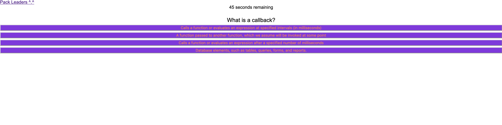

# Web-API_Coding_Quiz

The goal of this project was to create a quiz that saves the users score to the browsers local storage. 

Here's a link the the application: [link](https://carpetonberry.github.io/Web-API_Coding_Quiz/)

Here's a a link to the github repository: [link](https://github.com/CarpeTonberry/Web-API_Coding_Quiz)

## Layout of Application 

## Structure of JS

The JS creates DOM elements and cycles through all of the quiz questions. As you contiune throughout the quiz, it creates and then deletes these elements while tracking the results of the users inputs. 

## Future Development 

There will be an extended local save that tracks multiple socres; however, as of now it only tracks the last submitted score. 

## Tl;DR
*If at first you don't succeed, try try try again!  

*Creating HTML/CSS elements with JS is game changing. 